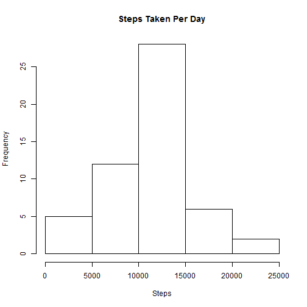
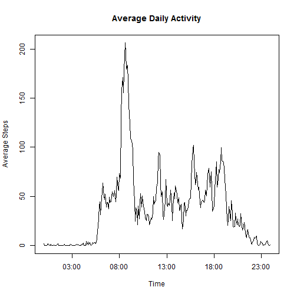
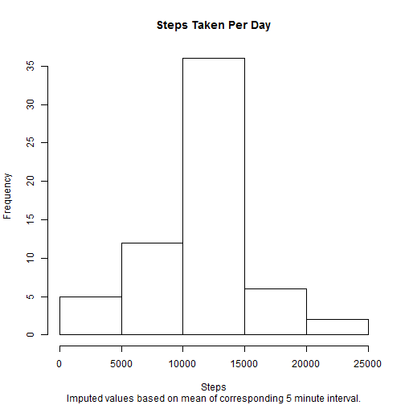
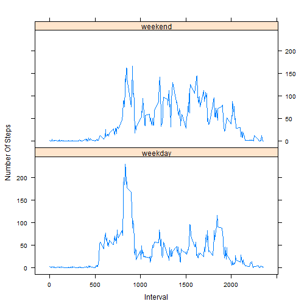

---
title: "Reproducible Research: Peer Assessment 1"
output: 
  html_document:
    keep_md: true
---


## Loading and preprocessing the data

```r
data <- read.csv(unz("activity.zip", "activity.csv"), header=TRUE)

daily <- aggregate(data$steps, by = list(data$date), sum)
names(daily) <- c("date", "steps")

interval <- aggregate(data$steps, by = list(data$interval), mean, na.rm = TRUE)
names(interval) <- c("interval", "steps")
interval$interval <- formatC(interval$interval, width = 4, format = "d", flag = "0")
interval$interval <- strptime(interval$interval, "%H%M")
```


## What is mean total number of steps taken per day?

```r
hist(daily$steps, main = "Steps Taken Per Day", xlab = "Steps", ylab = "Days")
```

 

```r
meansteps <- format(mean(daily$steps, na.rm = TRUE), scientific = FALSE)
mediansteps <- median(daily$steps, na.rm = TRUE)
```

The mean of the total number of steps taken per day is 10766.19 and the median is 10765.


## What is the average daily activity pattern?

```r
plot(x = interval$interval, y = interval$steps, type = "l", main = "Averaage Daily Activity", xlab = "Time", ylab = "Average Steps")
```

 

```r
maxsteps <- which.max(interval$steps)
maxinterval <- format(interval$interval[maxsteps], "%H:%M:%S")
```

The maximum number of steps over all days was taken for the 5 minute time interval starting at 08:35:00. 

## Imputing missing values

```r
missing <- sum(!complete.cases(data))
```

There are 2304 rows with incomplete data in the dataset.

Missing values are being imputed based on the mean of the 5 minute time interval for that entry.

```r
imputed <- data

lapply(which(is.na(imputed$steps)), function(index) {
  imputed$steps[index] <<- mean(imputed[imputed$interval == imputed$interval[index], "steps"], na.rm = TRUE)
})

dailyimputed <- aggregate(imputed$steps, by = list(imputed$date), sum)
names(dailyimputed) <- c("date", "steps")

hist(dailyimputed$steps, main = "Steps Taken Per Day", xlab = "Steps", ylab = "Days", sub = "Imputed values based on mean of corresponding 5 minute interval.")
```

 

```r
meansteps <- format(mean(dailyimputed$steps, na.rm = TRUE), scientific = FALSE)
mediansteps <- format(median(dailyimputed$steps, na.rm = TRUE), scientific = FALSE)
```

The mean of the total number of steps taken per day is 10766.19 and the median is 10766.19.

## Are there differences in activity patterns between weekdays and weekends?

```r
day <- factor(ifelse(weekdays(as.Date(imputed$date)) %in% c("Saturday", "Sunday"), "weekend", "weekday"))
imputed <- cbind(imputed, day = day)

imputedinterval <- aggregate(imputed$steps, by = list(imputed$interval, imputed$day), mean, na.rm = TRUE)
names(imputedinterval) <- c("interval", "day", "steps")

library(lattice)
xyplot( steps ~ interval | day,
        data = imputedinterval,
        type = "l",
        layout = c(1, 2),
        xlab = "Interval",
        ylab = "Number Of Steps")
```

 
